```mermaid
flowchart TD
    A["📝 INPUT\nTopic + Script + Scene List\n🔧 ChatGPT"] --> B

    subgraph PHASE_1["🎨 PHASE 1 — Character Lock\n🔧 Nanobanana PRO"]
        B["AI generates character\nreference image (4 options)"] --> C{"👤 USER REVIEW\nSelect & freeze\ncharacter design"}
        C -->|Approved| D["Character locked as\nreference for all scenes"]
        C -->|Redo| B
    end

    D --> E

    subgraph PHASE_2["🖼️ PHASE 2 — Scene Images\n🔧 Nanobanana PRO + Gigapixel 8"]
        E["AI generates scene image\n(next scene in queue)"] --> F{"👤 USER REVIEW\nApprove scene image"}
        F -->|Approved| G{"More scenes?"}
        F -->|Redo| E
        G -->|Yes| E
        G -->|No, all scenes done| H["All scene images approved"]
    end

    H --> I

    subgraph PHASE_3["🎬 PHASE 3 — Video Generation\n🔧 Veo 3.1 (Anchor) + Kling 3.0 (B-Roll)"]
        I["AI generates video clip\nfrom approved image\n(voice + lip-sync baked in)"] --> J{"👤 USER REVIEW\nApprove video clip"}
        J -->|Approved| K{"More clips?"}
        J -->|Redo| I
        K -->|Yes| I
        K -->|No, all clips done| L["All video clips approved"]
    end

    L --> M

    subgraph PHASE_4["🎵 PHASE 4 — Audio Layer\n🔧 ElevenLabs SFX"]
        M["👤 USER UPLOADS\nBackground music track"] --> N["AI layers BGM + SFX\nauto-ducking under voice"]
    end

    N --> O

    subgraph PHASE_5["✂️ PHASE 5 — Final Assembly\n🔧 CapCut"]
        O["AI adds transitions,\ncaptions, and effects"] --> P["Auto-export\n1080×1920 · 9:16 · H.264"]
        P --> Q{"👤 FINAL REVIEW\nMobile preview"}
        Q -->|Approved| R["✅ READY TO PUBLISH\nFacebook · Instagram\nTikTok · YouTube"]
        Q -->|Adjustments needed| O
    end

    style PHASE_1 fill:#fef3c7,stroke:#f59e0b,stroke-width:2px
    style PHASE_2 fill:#dbeafe,stroke:#3b82f6,stroke-width:2px
    style PHASE_3 fill:#ede9fe,stroke:#8b5cf6,stroke-width:2px
    style PHASE_4 fill:#d1fae5,stroke:#10b981,stroke-width:2px
    style PHASE_5 fill:#fce7f3,stroke:#ec4899,stroke-width:2px
```

# BuLoop AI Video Pipeline — Automated Production Flow

> **One-page overview for client submission**
> Automated AI video production with human-in-the-loop approval at every critical stage.

---

---

## Pipeline Summary — Tools & Time per Phase

| Phase | What Happens | Tool(s) | Time | User Action |
|-------|-------------|---------|------|-------------|
| **Input** | Topic ideation, script, scene breakdown | ChatGPT | ~30 min | Approve script & scene plan |
| **1. Character Lock** | Generate 4 character options, user picks one | Nanobanana PRO (Higgsfield) | ~15 min | Select & freeze character |
| **2. Scene Images** | Generate each scene image with locked character + upscale | Nanobanana PRO + Gigapixel 8 | ~45 min | Approve each scene (×12) |
| **3. Video Clips** | Animate images → video with voice + lip-sync | Veo 3.1 (anchor) + Kling 3.0 (B-roll) | ~60 min | Approve each clip (×12) |
| **4. Audio Layer** | User provides BGM; AI generates SFX, layers with ducking | ElevenLabs SFX | ~15 min | Upload BGM track |
| **5. Final Assembly** | Transitions, captions, effects, color grade, export | CapCut | ~30 min | Final mobile preview |
| | | | **~3.25 hrs** | |

---

## Cost per Full Production Cycle (1 Video)

| Service | Monthly Plan | Per-Video Cost* | Role |
|---------|-------------|----------------|------|
| ChatGPT Plus | $20/mo | ~$0.65 | Script, scene planning, prompt generation |
| Nanobanana PRO (Higgsfield) | $20/mo | ~$0.65 | Character reference + 12 scene images |
| Gigapixel 8 | $99 one-time | ~$0.00 | Image upscaling (one-time purchase) |
| Google Veo 3.1 (AI Studio) | Free / $20/mo | ~$0.00–$0.65 | 5 anchor video clips with voice + lip-sync |
| Kling 3.0 Pro | $10/mo | ~$0.33 | 7 B-roll video clips |
| ElevenLabs Creator | $22/mo | ~$0.73 | BGM generation + sound effects |
| CapCut Pro | $10/mo | ~$0.33 | Final editing, captions, transitions, export |
| Pixabay | Free | $0.00 | Backup music library (royalty-free) |
| **Total** | **~$102/mo** | **~$2.70–$3.35** | |

> \*Per-video cost assumes **~30 videos/month** (1 per day). At lower volume, per-video cost increases proportionally.

---

## Key Design Decisions

| Decision | Rationale |
|----------|-----------|
| **Voice + lip-sync baked into Veo** | Eliminates sync issues entirely — no separate voiceover step |
| **BGM only, no voiceover overlay** | Protects lip-sync integrity; music ducked under voice automatically |
| **Human review at every gate** | No batch processing — each asset approved before next step |
| **Scene-by-scene generation** | Prevents compounding errors across 12 scenes |

## Output Specification

| Spec | Value |
|------|-------|
| Format | 9:16 vertical MP4 (H.264) |
| Resolution | 1080×1920 |
| Duration | 30–50 seconds |
| Frame Rate | 30 fps |
| Platforms | Facebook Reels, Instagram Reels, TikTok, YouTube Shorts |
| Automation Rate | ~80% automated, ~20% human review |
